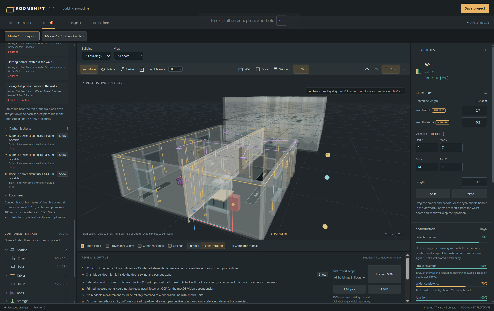
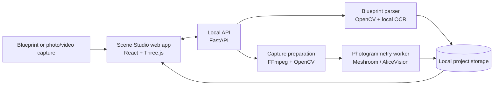

# Scene Studio

Scene Studio turns a floor plan, photo set, or short room walkthrough into an editable 3D space. Upload a blueprint to build a metric room layout, or capture a room from photos/video to create a mesh. Then inspect the result, edit walls and furniture, plan basic services, and export the scene.



## Architecture



The web app provides the editor, 3D viewport, project controls, and exports. The local API owns uploads, reconstruction jobs, validation, and project persistence. Blueprint reconstruction produces editable rooms, walls, doors, and windows; capture reconstruction produces a calibrated mesh that can be opened in the same editor.

## Features

- Upload PNG or JPEG blueprints and reconstruct editable metric rooms.
- Use printed dimensions, an estimated scale, or a manual reference measurement.
- Upload a 10–60 second walkthrough or 20–40 overlapping photos to reconstruct a colored room mesh.
- Calibrate mesh scale and floor alignment from picked points.
- Draw and edit walls, doors, and windows with snapping, undo/redo, and completeness checks.
- Add, transform, resize, and snap furniture; import local GLB, glTF, OBJ, PLY, or STL components.
- Review provenance and confidence, compare against the original, and lay out conceptual wiring and plumbing.
- Group floors and buildings, save projects locally, and export Scene JSON or GLB.

## Run locally

Scene Studio requires Python 3.12+ and Node 22.12+.

Start the API in one terminal:

```powershell
cd services/api
python -m venv .venv
.venv\Scripts\python -m pip install -r requirements.txt
.venv\Scripts\python -m uvicorn roomshift_api.main:app --host 127.0.0.1 --port 8000 --reload --reload-dir roomshift_api
```

Start the web app in a second terminal:

```powershell
cd apps/web
npm ci
$env:VITE_USE_MOCK_API = 'false'
$env:VITE_API_BASE_URL = 'http://127.0.0.1:8000'
npm run dev
```

Open <http://127.0.0.1:5173>.

For an offline blueprint demo, use mock mode instead:

```powershell
cd apps/web
$env:VITE_USE_MOCK_API = 'true'
npm run dev
```

Photo/video reconstruction also needs the local Meshroom worker. Follow [the reconstruction worker setup](services/reconstruction/README.md#meshroom-setup-default-engine). Project data is stored locally under `services/api/data/`.

## Verify

```powershell
cd services/api
.venv\Scripts\python -m pytest -q
```

```powershell
cd apps/web
npm test
npm run build
```

See [the API guide](services/api/README.md), [the web-app guide](apps/web/README.md), and [the prototype scope](docs/architecture/prototype-scope.md) for more detail.
